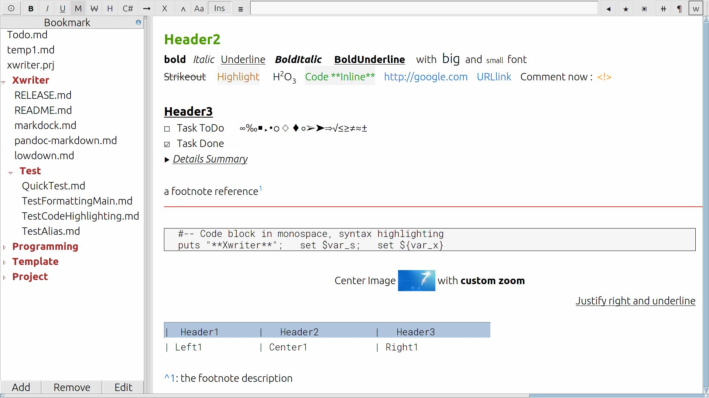
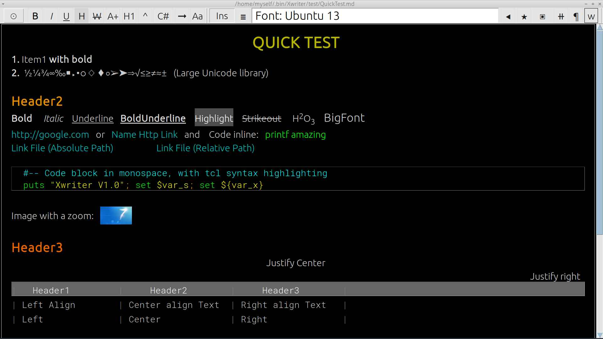
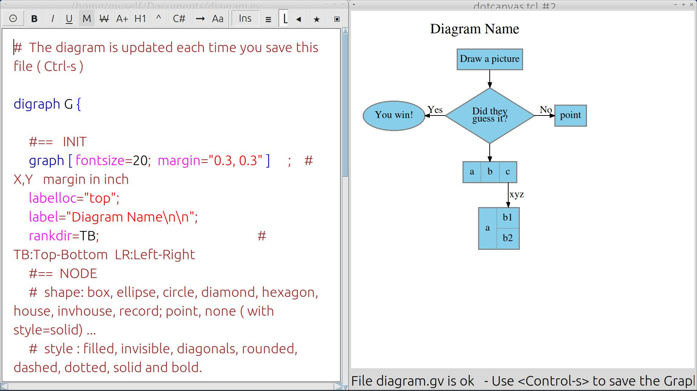

# Xwriter  

##  About

Xwriter is a plain-text/rich-text editor for Linux  
based on an extended markdown syntax ( [Markdock](markdock.md) )  

Contact/Discussion :  
[ Mastodon ](https://fosstodon.org/@sudokill)  
[ Reddit ](https://www.reddit.com/r/markdock/)  

  

   

   

##  Features

+  3 themes :  Light, Dark and Terminal  
+  Image with custom width  
+  Open URL and File links  
+  Table of Contents, Bookmarks  , Recent Files  
+  Markdown archive with image / encryption  
+  Syntax highlighting  
+  Diagram editor ( Graphviz )  
+  Multi-language Spelling ( with english custom dictionary )  
+  UTF-8 compliant / Large Unicode symbols  library
+  Include / Compare Files  
+  Export to HTML/PDF ( with custom style sheet CSS )  
+  Export to ODT/DOCX/Epub ( Require Pandoc  installation)  
+  Import Documents and URL ( Require Pandoc  installation)  
+  Fast / Small footprint  ( No GTK/QT dependencies )  
+  Pandoc compatibility    
+  Test on Debian-stable-XFCE,  LinuxMint-21-Cinnamon,  Endeavouros_Cassini_neo_22_12, Manjaro KDE-21.3.7-220816,  Ubuntu 22-10 gnome  

## Install

If you have previously installed Xwriter, Always read the  [Release Note](RELEASE.md)  
On terminal :  

1.  Install Main Packages  
 	- Debian/Mint : ` sudo apt  install    tcl   tk   libtk-img   sed  zip  unzip  librsvg2-bin  webp  lowdown `  
	- Arch : ` sudo  pacman  -Syy    tcl   tk   sed   zip  unzip  librsvg  libwebp   lowdown `  
	( 'pacman -S yay' , then 'yay -S  tkimg' may be required for 32bit architecture or if jpeg images are not displayed )  
	- Ubuntu:  
	` sudo add-apt-repository universe;   sudo apt update `  
	` sudo apt  install    tcl8.6   tk8.6   curl   sed   zip  unzip   lowdown   webp `  
	if jpeg images are not displayed, install package  lib64/ubuntu-libtk-img_1.4.13_amd64.deb  
2.  Install package for spelling (en/fr...) and conjugation (fr) : `sudo apt install   aspell-en  aspell-fr  verbiste`  
3.  Install graphviz ( diagram ) and pandoc ( import/export documents ) : ` sudo apt install graphviz pandoc `  
4.  Configure  desktop menu entry  
	Edit  xwriter.desktop  to change the executable path ( Line 'Exec'  )  
	Execute `cp xwriter.desktop ~/.local/share/applications/ `  

## Usage

After installation, on Terminal :  

- Go to installation folder and execute ` wish ./xwriter `  
	( Ubuntu :  wish8.6 ./xwriter )  
- Use 'Ctrl+Space' to view/hide markdown syntax, F1 for help  
- For an example, execute ` wish ./xwriter markdock.md `    

About Font Rendering :  
if the font rendering is not good:  `cp  fonts.conf  ~/.config/fontconfig/`  and edit this file to adjust font rendering ( require logout/login to apply )  
You can also copy fonts in folder 'fonts' to your _home_  folder ~/.fonts  

## Limitations / Known Bugs

1.  Application crash if font 'Noto Color Emoji' is selected  
2.  On Ubuntu  , some features requiring /tmp folder access may not work :  
	-  HTML preview not working but export HTML works  
	-  Archive .mdz not working  
	-  Import URL not working  

