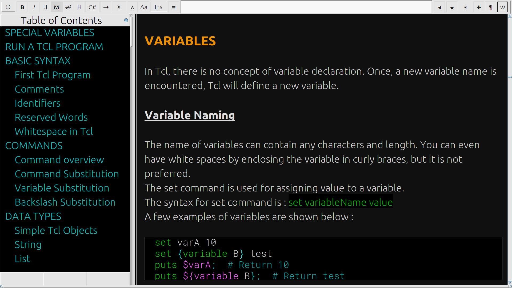

The project moved to https://codeberg.org/sudokill/Xwriter

Feel free to contribute on github : I still read my github account


# Xwriter  


##  About

Xwriter is a Markdown/Code editor for Linux  
  
The markdown editor uses an extended markdown syntax ( [Markdock](markdock.md) )  
The code editor is minimalist/experimental   
 

 
   

   

   

  


##  Features

+  3 themes :  Light, Dark, Terminal   
+  Table of Contents, Bookmarks , Recent Files  
+  Load/Save ZIP Archive with image / encryption  
+  Syntax highlighting    /  Project Mode for coding (experimental)
+  Multi-language Spelling ( with english custom dictionary )  
+  Translation  
+  Diagram editor ( Graphviz/Mermaid )  
+  Code evaluation with  [pantcl](https://github.com/mittelmark/pantcl)  
+  UTF-16 / Large Unicode symbols  library    
+  Include / Compare Files  
+  Foldable Code/Paragraph  
+  Shell commands with alias  
+  Navigation  ( Go back/Previous link )  
+  Export to HTML/PDF ( with custom style sheet CSS )  
+  Export to ODT/DOCX/Epub ( Require Pandoc  installation )  
+  Import Documents and URL ( Require Pandoc  installation )  
+  Pandoc compatibility    
+  Test on Debian-stable-XFCE,  LinuxMint-21-Cinnamon,  Endeavouros_Cassini_neo_22_12, Manjaro KDE-21.3.7-220816,  Ubuntu 22-10 gnome, Lubuntu 23-10  ,  Fedora-KDE-39,  Weston/Xwayland  


## Install

If you have previously installed Xwriter, Always read the  [Release Note](RELEASE.md)  
On terminal :  

1.  **Install Main Packages**  
	- Debian/Mint :  
		 ` sudo apt  install    tcl   tk   libtk-img    zip  unzip  librsvg2-bin  webp `  
	- Fedora :  
		 ` sudo dnf  install    tcl   tk   libtk-img    zip  unzip  librsvg2-tools  libwebp-tools `  
	- Arch :  
		 ` sudo  pacman  -Syy    tcl   tk   zip  unzip  librsvg  libwebp `  
	( 'pacman -S yay' , then 'yay -S  tkimg' may be required for 32bit architecture or if jpeg images are not displayed )  
	- Ubuntu:  
	` sudo add-apt-repository universe;   sudo apt update `  
	` sudo apt  install    tcl8.6   tk8.6   curl   zip  unzip   librsvg2-bin  webp `  
	if jpeg images are not displayed, install package  lib/ubuntu-libtk-img_1.4.13_amd64.deb  
2.  **Import/Export documents (Recommended)**, Install  lowdown or pandoc :   
	` sudo apt install   lowdown  pandoc `  
3.  **Spelling/Translation and conjugation (Optional)** :  
	 `sudo apt install   aspell-en    aspell-fr   translate-shell   verbiste`  
4.  **Diagrams (Optional)** : Install graphviz :   
	` sudo apt install   graphviz`  
5.  **Code evaluation (Optional)**, enable pantcl filter :  ` chmod +x plugin/pantcl.tapp `  
6.  **Desktop integration** :  
	Edit  ./desktop/xwriter.desktop  and change executable path ( Line 'Exec'  )  
	Execute :  
```  
cd ./desktop  
cp xwriter.desktop   ~/.local/share/applications/   
xdg-mime install  --mode user xwriter-mime.xml  
xdg-icon-resource install --context mimetypes --size 48  xwriter.png  xwriter  
update-mime-database ~/.local/share/mime/  
update-icon-caches ~/.local/share/icons  
```  


## Usage

After installation, on Terminal :  

- Go to installation folder and execute ` wish ./xwriter `  
	( Ubuntu :  wish8.6 ./xwriter )  
- Use 'Ctrl+Space' to view/hide markdown syntax, F1 for help  
- For an example, execute ` wish ./xwriter markdock.md `    


##  Limitations / Known Bugs

1.  PNG images with transparency can significantly reduce loading speed  
2.  On Ubuntu, some features may not work due to forbidden access to `/tmp` folder  
As a temporary solution, edit the file [xwriter](xwriter) and change the line 'set TempDir'  to "$::env(HOME)/Documents/xwriter"  
3.  Wayland environment is not optimum and depends on Xwayland
4.  In project/development mode,  Code folding for python functions (def) works only if the function end with a double-empty lines  


##  Special thanks to

-  Detlef Groth, Schwielowsee, Germany for [pantcl filters](https://github.com/mittelmark/pantcl)   
