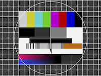

# TEST ARCHIVE  

1. Load this file, Toolbar > SaveAs Archive
2. Load The new archive created
3. Make a change in the main file, insert new image
4. Save Archive and reload archive (from recent file menu). 
5. Check Archive is updated correctly with the new image
6. Enter text in bold and check that Ctrl-R (Reload file) update/format the file
7. Check that absolute path below are converted in relative path in .mdz file ( don't work with svg/webp images )
8. Load 2 different archives. Check Archive content
9. Create encrypted archive and check good/wrong password works as expected

__Absolute Path on same source folder/subfolder__
  
  
 

__Absolute Path on different folder__

 

__Relative Path (Same Folder and subFolder)__

  
  
 
 

__Image With HTTP link__

