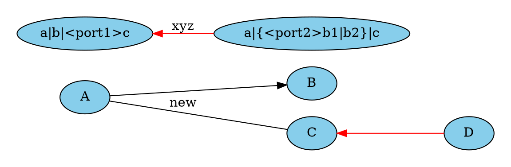

# Test Code Highlighting  


The code syntax is highlighted when putting the cursor on the block Code

##  No Language
```
# This is a test of Code Block : **No markdown parsing**
		seta  10;
		if { $a != 10 || ($a <= 1 && $a == 2) } { puts "Test String" }
```

##  Test Word Boundary
```tcl
# The word 'set' only highlight when not in another word
set qsdq set setqsd -set gdsetgg  SET gdset  set;  set- 
this is 'a test' with 'multiple string' and args='?' and emptystring ''
this is "a test" with "multiple string" and args="?" and emptystring ""
```

##  Test Operator

```c
No Highlighting :  +  -  *  /  %  ~  &  <  >  ^
Highlighting : 
|  !  &&  ||  ==  !=  <=  >=  <<  >>  >>>
+=  -=  *=  /=  %=
&=  |=  ^=  >>=  <<=
```

## C
```c
/* Test of C code     Alias: c    Extension .c  */
#include "terminal.h"
#define clamp(x, lower, upper)  // inline comment
struct buf {
    bool solid_shades;
    int thickness[2];
}
static const pixman_color_t white = {0xffff, 0xffff, 0xffff, 0xffff};
static void
#ifdef ENABLE_WRAPPING
		h[1] += remaining;
#endif
change_buffer_format(struct buf *buf, pixman_format_code_t new_format)
	if (openfile->current == was_current && ISSET(BREAK) && cur <= done)
 else if (!buf->solid_shades && fmt == PIXMAN_a8)
	LOWER_LEFT = 1 << 2,   
}
 case 0x1fb4d:  
        p1_x = p2_x = width; p3_x = 0;
        break;
```

## C++
```cpp
/* Test Of C++ block.  Alias: cpp    Extension .cpp .c++ */
#include <iostream>
int main(int argc, char *argv[]) {
  /* An annoying "Hello World" example */
  for (auto i = 0; i < 0xFFFF; i++)
    cout << "Hello, World!" << endl;
  char c = '\n';
  unordered_map <string, vector<string> > m;
  m["key"] = "\\\\"; // this is an error
  return -2e3 + 12l;
}
```

## C#
```csharp
// Test Csharp      Alias: csharp    Extension .cs
using System.IO.Compression;
namespace MyApplication
{
    [Obsolete("...")]
    class Program : IInterface
    {
        public static List<int> JustDoIt(int count)
        {
            Span<int> numbers = stackalloc int[length];
            Console.WriteLine($"Hello {Name}!");
            return new List<int>(new int[] { 1, 2, 3 })
        }
    }
}
```

## CONSOLE
```console
$ github-linguist
```

## CSS
```css
/*  Test CSS.   Alias: css,less,sass,scss,styl,stylus   Extension  .css */
@font-face {
  font-family: Chunkfive; src: url('Chunkfive.otf');
}
body { line-height: 120%; padding: 10px; color:"#F5F632" }
pre {  tab-size: 8; white-space: pre-wrap;  }    /* inline comment */
@import url(print.css);
@media print {
  a[href^=http]::after {
    content: attr(href)
  }
}
```

##  DIFF
```diff
	#  TEST  DIFF    ( alias:diff      Extension  .diff)
No Change
+ Added Code
- Deleted Code
No Change
```

##  DOT  (GRAPHWIZ)



## GO
```go
// Test Code GO       ( Alias:go    Extension  .go )
/*  Multiple-lines comment */
package main
import "fmt"
func main() {
    ch := make(chan float64)
    ch <- 1.0e10    // magic number
    x, ok := <- ch
    defer fmt.Println(`exitting now\`)
    go println(len("hello world!"))
    return
}
```

## HTML
```html
<!-- Alias: html xml xhtml   Extension  .html/.xml/.xhtml-->
<!DOCTYPE html>
<title>Title</title>
<style>body {width: 500px;}</style>
<script type="application/javascript">
  function $init() {return true;}
</script>
<body>
  <p checked class="title" id='title'>Title</p>
  <!-- here goes the rest of the page -->
</body>
```

## JAVA
```java
//  Alias: java   Extension  .java
/* @author John Smith <john.smith@example.com> */
package l2f.gameserver.model;
public abstract strictfp class L2Char extends L2Object {
  public static final Short ERROR = 0x0001;
  public void moveTo(int x, int y, int z) {
    _ai = null;  // inline comment
    log("Should not be called");
    if (1 > 5) { 				
      return;
    }
  }
}
```

## JAVASCRIPT
```javascript
// Alias: javascript,js,node,coffeescript,ecmascript,cjs  Extension  .js
storeNames("Mulder", 'Scully', "Alex Kryceck");
function $initHighlight(block, cls) {
		//  indented comment
		var args = Array.prototype(arguments, 1, 3);
		return args; // inline comment
		if (cls.search(/\bno\-highlight\b/) != -1)
			return process(block, true, 0x0F) + ` class="${cls}"`;
		for (var i = 0; i < arguments.length; i++) {
		/* This is also a comment */
    args.push(arguments[i])
  	return ( <div> <web-component>{block}</web-component> </div> )
		}
}
```	

## JSON

```json
[
	"compilerOptions": {
		/* This is a comment */
		// "incremental": true,            /* Inline comment */
  {
    "title": "apples",
    "count": [12000, 20000],
    "description": {"text": "...", "sensitive": false}
  },
  {
    "title": "oranges",
    "count": [17500, null],
    "description": {"text": "...", "sensitive": false}
  }
]
```


## KOTLIN

**Not Supported**
```kotlin
import kotlinx.serialization.Serializable
import kotlin.random.Random
interface Building
@Serializable
class House(
    private val rooms: Int? = 3,
    val name: String = "Palace"
) : Building {
    var residents: Int = 4
        get() {
            println("Current residents: $field")
            return field
        }
    fun burn(evacuation: (people: Int) -> Boolean) {
        rooms ?: return
        if (evacuation((0..residents).random()))
            residents = 0
    }
}
fun main() {
    val house = House(name = "Skyscraper 1")
    house.burn {
        Random.nextBoolean()
    }
}
```

## LUA
```lua
--[[
Simple signal/slot implementation
]]
local debug = require("pandocker.utils").debug
local signal_mt = {
    __index = {
        register = table.insert
    }
}
		-- Another Funtion
function signal_mt.__index:emit(... --[[ Comment in params ]])
    for _, slot in ipairs(self) do
        slot(self, ...)
    end
end
local function create_signal()
    return setmetatable({}, signal_mt)
end

-- Signal test
local signal = create_signal()
signal:register(function(signal, ...)
    print(...)
end)
signal:emit('Answer to Life, the Universe, and Everything:', 42)

```

## MAKEFILE

**Not Supported**
```makefile
# Makefile
BUILDDIR      = _build
EXTRAS       ?= $(BUILDDIR)/extras
.PHONY: main clean
main:
	@echo "Building main facility..."
	build_main $(BUILDDIR)
clean:
	rm -rf $(BUILDDIR)/*
```

## PYTHON
```python
# Test of Python Code Block.  Alias: python,py    Extension: .py
import requests
grades = [67, 100, 87, 56]   # inline Comment
def somefunc(param1='', param2=0):
parser.add_argument("url", nargs="?", help="URL", default=None)
if url == "":
else:
    while True:
            continue
for link in links:  
		try:
 		except :
    break
class SomeClass:
    pass
>>> message = '''interpreter
... prompt'''
```

## PHP
```php
// Test PHP				Alias: php     Extension: .php
# Comment
require_once 'Zend/Uri/Http.php';
namespace Location\Web;
abstract class URI extends BaseURI implements Factory
{
    abstract function test();
   public static $st1 = 1;
    const ME = "Yo";
    var $list1 = NULL;
    private $var1;
    /* Block Comment*
     * Returns a URI
    */
    static public function _factory($stats = array(), $uri = 'http')
    {
        echo __METHOD__;
        $schemeSpecific = isset($uri[1]) ? $uri[1] : '';
        // Security check
        if (!ctype_alnum($scheme)) {
            throw new Zend_Uri_Exception('Illegal scheme');
        }
        $this->list=list(Array("1" => 2, 2=>self::ME, 3 =>\Web\URI::class));
            'uri'   => $uri,
            'value' => null,
        ];
    }
}
```

## PERL
```perl
# loads object
sub load
{
  my $flds = $c->db_load($id,@_) || do {
    Carp::carp "Can`t load (class: $c, id: $id): '$!'"; return undef
  };
  my $o = $c->_perl_new();
  $id12 = $id / 24 / 3600;
  $o->{'ID'} = $id12 + 123;
  #$o->{'SHCUT'} = $flds->{'SHCUT'};
  my $p = $o->props;
  my $vt;
  $string =~ m/^sought_text$/;
  $items = split //, 'abc';
  $string //= "bar";
  for my $key (keys %$p)
  {
    if(${$vt.'::property'}) {
      $o->{$key . '_real'} = $flds->{$key};
      tie $o->{$key}, 'CMSBuilder::Property', $o, $key;
    }
  }
  $o->save if delete $o->{'_save_after_load'};
  # GH-117
  my $g = glob("/usr/bin/*");

  return $o;
}
__DATA__
@@ layouts/default.html.ep
<!DOCTYPE html>
<html>
  <head><title><%= title %></title></head>
  <body><%= content %></body>
</html>
__END__

=head1 NAME
POD till the end of file
```

## RUBY
```ruby
# Test Code RUBY   Alias: ruby,jruby,macruby,rake,rb,rbx   Extension: .rb .ruby
class Greeter
  def initialize(name)
    @name = name.capitalize
  end
  def salute
    puts "Hello #{@name}!"
  end
end
g = Greeter.new("world")
#add is the function which will return some of the numbers passed to it.
def add(a, b)
return a+b
end
# calling the addition method
sum= add(3,4)
puts "The some of the numbers are #{sum}"
=begin
This is a multiple line comment
use '=begin' and '=end' 
=end
```

## RUST
```rust
// Text Code Rust         Alias: rust, rs     Extension  .rs
#[derive(Debug)]
pub enum State {
    Start,
}
impl From<&'a str> for State {
    fn from(s: &'a str) -> Self {
        match s {
            "start" => State::Start,
            "closed" => State::Closed,
            _ => unreachable!(),
        }
    }
}
```

##  SHELL
```shell
#!/bin/bash      Alias: shell,sh,bash,zsh 
[ "$1" ] && [[ $1 != 2 ]] || [[ $1 == 2 ]] && echo OK
alias to='nano ~/.to.md'
sos(){ for item in $a; do clear; done}
case $string in      
		# Comment with tabs
  $pattern) echo "Match" ;;   # inline comment
  *)  ;; 
esac
if [ "$UID" -ne 0 ]
then
 echo '"quoted text"' | tr -d \" > text.txt
fi
```

## SQL

**Not Supported**
```sql
CREATE TABLE "topic" (
    "id" integer NOT NULL PRIMARY KEY,
    "forum_id" integer NOT NULL,
    "subject" varchar(255) NOT NULL
);
ALTER TABLE "topic"
ADD CONSTRAINT forum_id FOREIGN KEY ("forum_id")
REFERENCES "forum" ("id");

-- Initials
insert into "topic" ("forum_id", "subject")
values (2, 'D''artagnian');
```

## SWIFT

**Not Supported**
```swift
import Foundation

@objc class Person: Entity {
  var name: String!
  var age:  Int!

  init(name: String, age: Int) {
    /* /* ... */ */
  }

  // Return a descriptive string for this person
  func description(offset: Int = 0) -> String {
    return "\(name) is \(age + offset) years old"
  }
}
```


##  TCL
```tcl
# TCL Code Block     Alias: tcl      Extension  .tcl
proc { a b } {
		set var0 10;
		# Indented comment
		if { $a != 10 || ($a <= 1 && $a == 2) } { puts "Test String" }
		set b [expr $a == 1 ? 20: 30];  # inline Comment
		puts 'Test String $b\n'
}
```

## TYPESCRIPT
```typescript
//  This is a comment 
class MyClass {
  public static myValue: string;
  constructor(init: string) {
    this.myValue = init;
  }
}
import fs = require("fs");
module MyModule {
  export interface MyInterface extends Other {
    myProperty: any;
  }
}
declare magicNumber number;
myArray.forEach(() => { });    // This is an inline comment
```

## TOML / INI
```toml
[package]
name = "some_name"
authors = ["Author"]
description = "This is \
a description"

[[lib]]
name = ${NAME}
default = True
auto = no
counter = 1_000
```


##  V
```v
//  Comment    Alias:  v      Extension:   .v
import os
a, b := foo()
name := 'Bob'
module mymodule
interface IFoo { foo() }
const ( numbers = [1, 2, 3] )
struct Point {
	x int
	y int
}
large_number := i64(9999999999)
interg := int(98)
s[0] = `H`
names << 'Peter'
enum Color {  red }
type ObjectSumType = Line | Point
assert `\xe2\x98\x85`.bytes() == [u8(0xe2), 0x98, 0x85]
s += 'world'    // `+=` is used to append to a string
assert name.len == 3       
assert name[1..3] == 'ob'
__global:
assert sizeof(Foo) == 8
assert __offsetof(Foo, a) == 0
assert rocket_string[0] != `🚀`
union Rgba32 {
	Rgba32_Component
	value u32
}
sz := sizeof(Rgba32)
unsafe {
	println('Size: ${sz}B,clr1.b: ${clr1.b},clr2.b: ${clr2.b}')
}
mut age := 20  // mutable variable
fn main() {
	println(os.args, 'hello world')  // comment
	age = 21
	if parser.token == .plus || parser.toke
	println(1 in nums) // true
	println(4 !in nums) // true
}
for i <= 100 {
	sum += i
	i++
}
pub fn public_function() {
	return x + y
	if iter.idx >= iter.arr.len { return none }
}
even_fn := nums.filter(fn (x int) bool {
	return x % 2 == 0
})
if true { goto my_label )
} else if a > b {  continue outer)
} else {  break outer  }
if x !is Abc {  println('Not Abc')  }
defer { f.close() }
match x {  Abc {  println(x)  }  }
if xbar is My {} else if x.bar is MyS { new:=x.bar as MyStruct2 }
println('hello world')
eprintln('file: ' + @FILE + ' | line: ' + @LINE + ' | fn: ' + @MOD + '.' + @FN)
vm := vmod.decode( @VMOD_FILE ) or { panic(err) }
$for field in User.fields {
	$if field.typ is string {  $env('ENV_VAR') }
} $else $if gcc {  return $tmpl('1.txt') }
$compile_error('Linux is not supported')
eprintln('${vm.name} ${vm.version}\n ${vm.description}')
```

## YAML
```yaml
#   Comment    Alias:  yaml, yml      Extension:   yml, yaml
Enterprise:
  color: "#814CCC"
  extensions:
  - ".bsl"
  - ".os"
  tm_scope: source.bsl
2-Dimensional Array:
  type: data
  extensions:
  - ".2da"
inline_keys_ignored: sompath/name/file.jpg
keywords_in_yaml:
  - true
  - false
  - TRUE
  - FALSE
  - 21
  - 21.0
  - !!str 123
```

