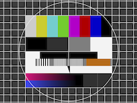

# TEST IMAGE  

## MARKDOWN SYNTAX

With Name 

With No Name 

On sub-folder. Warning: Preview will not display 

On same folder. Warning: Preview will not display   

## IMAGE AND WIDTH

**WARNING** : Different Zoom on same image **NOK**

Zoom1  
 Zoom 0.5  
 Zoom 2   

## SUPPORTED FORMAT
 
JPG   
PNG  
BMP  

GIF    No animation:  Only a fix picture is displayed

TIF  
XBM (On LIGHT Theme ONLY)  
TGA  

 SVG  (text displayed ? background color follow theme ?)   
 SVG  (check text is displayed+Zoomx2)   

WEBP (converted in PNG)   
  Image JP2000  : **NOK**

## TEST ZOOM ON SUPPORTED FORMAT
OK

##  2 IMAGE ON SAME LINE

Image1    and Image 2      

## TEXT FORMATING BEFORE/AFTER IMAGE: OK

**Bold** before  and **after image** OK, work with __underline__ ...

##  IMAGE JUSTIFICATION 
**WARNING**: Always include 1 space or any characters after image path 
Syntax Center : ` :::[Spaces/Tabs] +  + 1space/Any characters `

:::  

::::  

## WEB IMAGE
Text **before**  __Text__ after
To Test:
1. Empty Image cache in folder ~/.cache/xwriter and reopen document 
2. Check Image display an 'error' icon and check message when mouse hover the error icon
3. Check Image display after enable 'Display web image' from menu + a notification during downloading
4. Image display without download if document is re-open  ( Image downloaded on cache folder )

## HTML1   with width/height
</img>

lowdown, pandoc, github, codeberg: OK

## HTML1   with only width
</img>

codeberg, github, pandoc:, lowdown:  OK

##  HTML2
</img>

lowdown, pandoc, github: OK       codeberg NOK: display in full size

##  Markdown PHP extra in pixel

lowdown/pandoc OK      codeberg,github NOK : display in full zize

{width=150px height=150px}

##  Markdown PHP extra in pixel/ only width

lowdown/pandoc OK      codeberg,github NOK : display in full zize

{width=150px}

##  Markdown PHP extra in % of page width

{width=50% height=50%}

lowdown/pandoc OK     codeberg,github NOK but display in full zize

